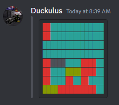

# `McHeadMessageGenerator`

Generates cool looking Messages of your Minecraft Head for Discord.
This is done using ANSI Color codes.
To learn more, check out [this guide](https://gist.github.com/kkrypt0nn/a02506f3712ff2d1c8ca7c9e0aed7c06).

### How to run

> First you need to build the Project 
```
npm install
./node_modules/.bin/tsc
```

> Then host it using the http server of your choice. For example:
```
python -m http.server
``` 

### Example
